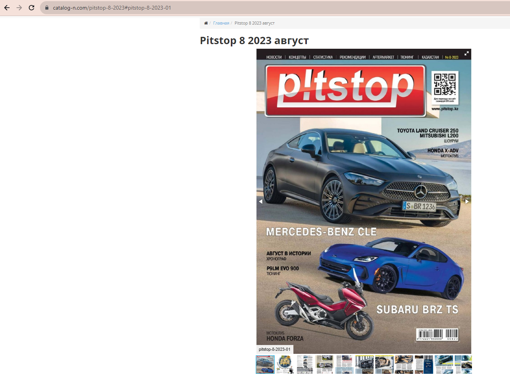
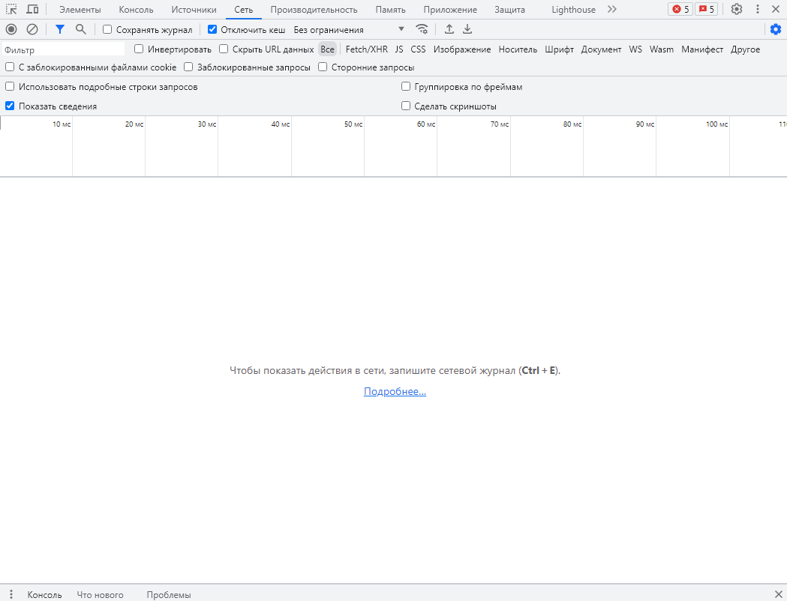
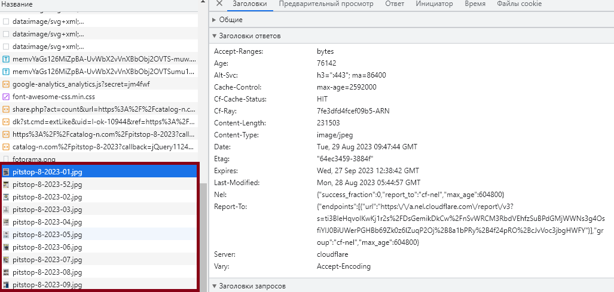

# Web_scraping_web_magazine

*This code generates a .pdf file using the content from a web magazine or journal.*

## Overview  
**Task:** Obtain a web magazine (journal) from the target website and convert it into a .pdf file.
**Solution:** Use Web-scraping.

**Programming language:** Python  
**Requirements:** [Requirements.txt](https://github.com/MvVeronica/Web_scraping_web_magazine/blob/main/requirements.txt)

## Project Structure
The project consists of 2 directories and 2 script files.

- **[Images](https://github.com/MvVeronica/Web_scraping_web_magazine/tree/main/Images)** : This directory is used to store images of pages of the web magazine (journal). After the function is executed, it allows you to work directly from the directory to avoid multiple requests to the website.

- **[Result](https://github.com/MvVeronica/Web_scraping_web_magazine/tree/main/Result)** : This directory is where the script saves the final .pdf file. The file is overwritten each time the script is run.

- **[proxy.py](https://github.com/MvVeronica/Web_scraping_web_magazine/blob/main/proxy.py)** : If you are using a proxy, fill in the file. If not, comment this section.

- **[MV_Web_scraping.py](https://github.com/MvVeronica/Web_scraping_web_magazine/blob/main/MV_Web_scraping.py)** : Main code file.py.

## Target site analysis
Open the target website on the page where the desired data is located.

    

  

Use inspect or developer tools -> Network -> All
>Press **Ctr+E** or click **Stop recording network log** on the Network panel. It turns grey to indicate that DevTools is no longer recording requests.

    

Reload the webpage and find the requests to images that are the pages of the web magazine. Inspect the URLs of the different pages.

    

Note, that pages differ from each other with the last symbols - number of page
>https://catalog-n.com/images/pitstop12/pitstop-8-2023-01.jpg  
https://catalog-n.com/images/pitstop12/pitstop-8-2023-02.jpg  
...  
https://catalog-n.com/images/pitstop12/pitstop-8-2023-11.jpg  
https://catalog-n.com/images/pitstop12/pitstop-8-2023-12.jpg

Use the common part of **URL** as the constant.  
**! Attention, in this case there is the situation, where pages [1;9] requeres zero [0] usage in front of them.**

## Project Logic
The Python script uses URL = 'https://catalog-n.com/images/pitstop12/pitstop-8-2023' as input data. 

Working libraries:
 - for working with requests:  [requests](https://pypi.org/project/requests/) 
 - for converting .jpg into .pdf: [img2pdf](https://pypi.org/project/img2pdf/)
 - for using fake useragent:  [fake_useragent](https://pypi.org/project/fake-useragent/)

### The code logic is very simple: ###
**Step 1.**  Function **get_data()** makes requests to webpages with images.
> It is important to use fake headers, proxy and time.sleep() to avoid website blocking.  

**Step 2.** Function **download_images()** downloads images into the local directory.  
>  It also helps you save data access for multiple tests without making requests to the website every time.  

**Step 3.** Function **img_list()** creates sorted by name list (images_list) of images from local directory.  

**Step 4.** Function **create_pdf_magazine()** converts list (images_list) to .pdf file using features of [img2pdf](https://pypi.org/project/img2pdf/) module.

 ## Usage
Before code usage:
- Git clone

Using test data:
- Delete the [Magazine.pdf](https://github.com/MvVeronica/Web_scraping_web_magazine/blob/main/Result/Magazine.pdf) file from the [Result](https://github.com/MvVeronica/Web_scraping_web_magazine/tree/main/Result) directory. (Also for checking that file creates)
- Run the script in Visual Studio Code.
- Check the [Result](https://github.com/MvVeronica/Web_scraping_web_magazine/tree/main/Result) directory. 😉

Using product data:
- Delete the [Magazine.pdf](https://github.com/MvVeronica/Web_scraping_web_magazine/blob/main/Result/Magazine.pdf) file from the [Result](https://github.com/MvVeronica/Web_scraping_web_magazine/tree/main/Result) directory.
- Delete all .jpg files from the [Images](https://github.com/MvVeronica/Web_scraping_web_magazine/tree/main/Images) directory.
- Choose your target web-magazine(journal).
- Make steps from **Target site analysis**. (Also replace URL and make other changes if necessary)
- Run the script in Visual Studio Code.
- Check the [Result](https://github.com/MvVeronica/Web_scraping_web_magazine/tree/main/Result) directory, your magazine/journal will appear there. 😉

## License  
MIT: https://rem.mit-license.org
